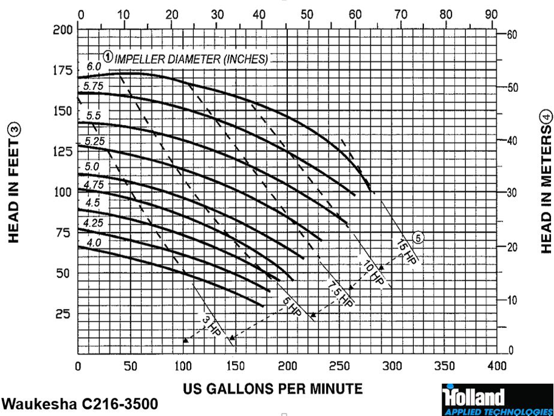
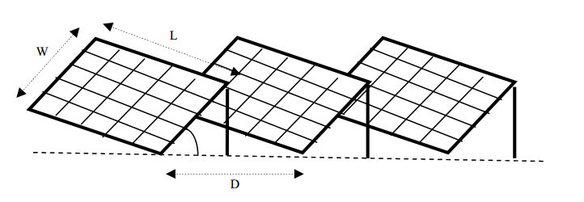

## Site Survey
Site is Shariatpur- latitude : 23.2866, longitude: 90.3748 Co-ordinates- N 23 17’12’’ , E 90 22’ 29’’
Crop in focus- potato
Tentative land size – 50000 square meters
The species chosen is  a 90-95 days crop
1. The crop has water requirements = 4000 m3 / ha in its lifetime of 95 days ( max chosen)
Now , 1 ha ( hectare) = 10000 square meter
So,50000 square meters= 5 ha
2. So, water requirement for the crop = 20000  m3
So, per day water requirement= 20000/95 =210.5  m3=55608.217 gallons =210500 liter

## Pump Requirements
- We select  surface pump and AC coupling for the system.
- We choose a reference total dynamic head ( TDH) of 140 feet = 42.672 meters ( generally in Bangladesh we have systems with dynamic head between 20 and 80 meters) 
- Potato is generally cultivated in winter seasons. We will consider the daily solar radiation values or peak sun hour values for months of Nov-Jan. For PV sizing- we take data of December when the peak sun hour is the lowest.The Data are derived from online solar radiation databases based on the site coordinates.

| Month 	| Daily Solar Radiation-horizontal KWh/m2/d  	|
|:-----:	|:-------------------------------------------:	|
|  Nov  	|                     4.28                    	|
|  Dec  	|                     4.21                    	|
|  Jan  	|                     4.36                    	|

## Pump Sizing
1. Water requirement=55608.217 gallons/day
2. Solar insolation for December=4.21 KWh/m2/day or a solar insolation level of 4.21 hr/day
3. Since, "Peak Sun Hour" in consideration is 4.21, we need to calculate the water flow requirement within this time frame.We have, flow rate = 55608.217/4.21=13208.6 gallons(ga)/hr or 220.14 ga/min (gpm)

4. Surface pumps used in solar irrigation are of centrifugal type. We now consult performance curve of surface pump from a manufacturer- Holland Applied Technologies. For the model **Waukesha C216-3500**, we get peak pump input power of 15 HP = 11190 W for a pump head (TDH) of 140 feet and water requirement of 220.14 gpm.
This will be the output required from PV installation.

## Planned PV System

 
## PV Installation Sizing

To find the peak PV power; we have to consider all the losses related to this PV system-
- PV efficiency= 0.85
- Cable efficiency=0.98
- Inverter efficiency = 0.90
- Panel soiling factor= 0.90

So, required power of PV installation= 11190/(0.98 x 0.85 x 0.90 x 0.90)=16.5 KWp

## Inverter Sizing
Inverter Rating = Total AC Load + 25%= 11190/0.8=13987.5 W

We choose 3 phase 380 V 15 KW solar pump inverterters which are readily available. To derive 380 V rms output from inverter, we require at least 380/0.78 = 487 V dc (Considering pulse width modulation scheme for inverter). We choose a 500 V dc PV array installation.

## PV array Sizing

Since the lattitude is below 25 degrees , for fixed tilt angle solar panels, the tilt angle= lattitude of the location times 0.87 =  23.2866 * 0.87 = 20.25 degrees. More information about tilt angles can be found [here](https://www.solarpaneltilt.com/)

We select some arbitrary values to complete the following calculations-

- Pc = Solar Panel Capacity (320 Wp) 
- D = Panel to Panel Clearance Distance (m)
- L = Panel Length (1.96 m) 
- Ap = Area Occupied by a Single Panel (m2)
- W = Panel Width (0.99 m)
- Panel to Panel Clearance Distance, D = W * 1.35
- Area Occupied by a Single Panel, Ap = L * D = L * W * 1.35 = 1.96 * 0.99 * 1.35 = 2.62 m2

Vmax = Voltage at Maximum Power Point (38 V)

VDC = System DC Voltage (500 V)

Total No. of Panel Required = Required PV Capacity / Pc = 16.5 KWp / 320 WP = 51.5 ≈ 52 pcs

Total Area for Panel Installation, ATPI = Total No. of Panel Required * Ap= 52 * 2.62 = 136.24 m2

No. of Panels in Series = VDC / Vmax  = 500/38 = 13.16 ≈ 14 pcs ( Nearest highest whole number )

No. of Panel String in Parallel = Total No. of Panels / No. of Panels in series = 52/14 ≈ 4 pcs

